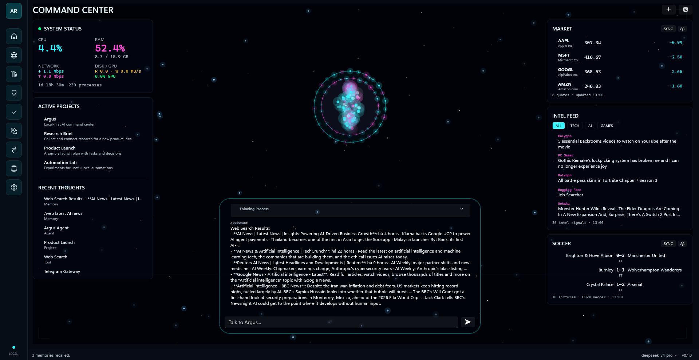
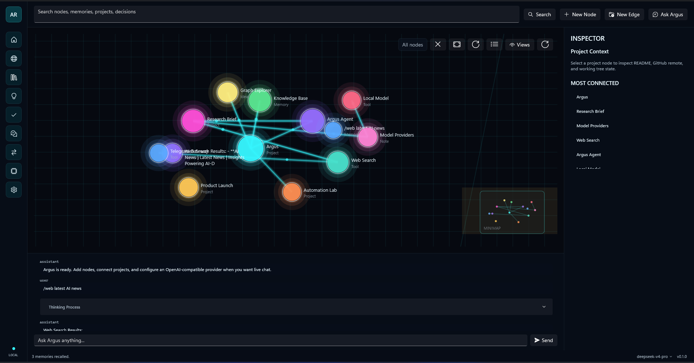
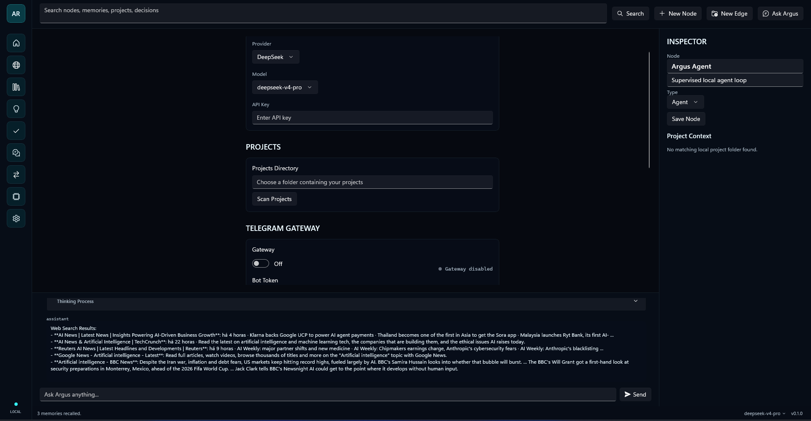

<div align="center">


# Argus

**A Windows-native, local-first AI agent that remembers, reasons over connected context, uses tools, and works alongside your projects.**

[](https://github.com/Guts444/argus-agent/actions/workflows/ci.yml)
[](https://github.com/Guts444/argus-agent/releases/latest)
[](LICENSE)

[Install](#install) · [Capabilities](#capabilities) · [LLMs](#connect-an-llm) · [SearXNG](#private-web-research-with-searxng) · [Updates](#in-app-updates)

</div>



Argus is a persistent desktop AI workspace, not a disposable chat window.
It combines a supervised tool-using agent, durable local memory, conversation
history, an interactive knowledge graph, live project context, private web
research, and remote Telegram access in one native WinUI 3 application.

Ask Argus to investigate a topic, recall something from an earlier session,
connect ideas, update the graph, preserve a decision, summarize a local
project, or search the web. The relevant memories, graph relationships,
conversation history, and selected project state can be assembled into the
LLM context before it answers.

Your database stays on your computer. LLM and Telegram credentials are stored
with Windows Credential Locker.

## Install

### PowerShell

```powershell
irm https://raw.githubusercontent.com/Guts444/argus-agent/main/scripts/install.ps1 | iex
```

The script downloads the latest `ArgusAgentSetup-x64.exe` from GitHub Releases.
The installer is self-contained and includes the .NET and Windows App SDK
runtime files required by Argus.

### Manual download

Download `ArgusAgentSetup-x64.exe` from the
[latest release](https://github.com/Guts444/argus-agent/releases/latest).
SHA-256 checksums are published beside every release.

**Requirements:** Windows 10 version 1809 or newer, x64. Windows 11 is
recommended. Docker Desktop is optional and only required for SearXNG research.

> The community installer is not currently Authenticode-signed. Windows may
> show a SmartScreen warning. Verify the published checksum before installing.

## Capabilities

### Supervised tool-using agent

- Runs a bounded multi-step agent loop instead of returning only one LLM reply.
- Searches memories and graph nodes before acting.
- Can create, update, and delete graph nodes; connect or remove relationships;
  save durable memories; and run local SearXNG web searches.
- Keeps tool actions and execution reasoning in a separate expandable log.
- Uses an editable `soul.md` persona to shape the agent's behavior.
- Preserves conversation context across sessions and supports clean `/new`
  conversation boundaries.

### Durable memory and context

- Stores conversations, messages, memories, graph data, and settings in local
  SQLite through EF Core.
- Recalls memories semantically with embeddings when the connected LLM supports
  them, with local text matching as a fallback.
- Promotes important messages into durable memories or graph nodes.
- Adds recalled memory, selected-node context, and indexed local-project state
  to prompts when relevant.
- Tracks estimated or LLM-reported context-window usage from the status bar.
- Uses FTS5 search across graph nodes and conversation messages.

### Connected knowledge graph

- Represents projects, ideas, tasks, decisions, notes, people, files, links,
  conversations, memories, tools, and agents as typed nodes.
- Creates typed relationships such as `depends_on`, `inspired_by`, `uses`,
  `blocked_by`, `decided_in`, and `reminds_me_of`.
- Includes a Win2D graph canvas with pan, zoom, drag, minimap, clustering,
  filters, fit/reset controls, node editing, tags, and connection inspection.
- Imports and exports graph data as JSON.

### LLM choice and reasoning controls

- Connects to DeepSeek, OpenAI, OpenRouter, Ollama, LM Studio, vLLM, or another
  OpenAI-compatible local or hosted LLM endpoint.
- Switches LLM service and model from the bottom status bar.
- Refreshes available OpenAI and OpenRouter model catalogs.
- Supports thinking mode and configurable reasoning effort where the selected
  LLM exposes those controls.
- Allows localhost LLM endpoints to run without an API key.

### Projects and working context

- Scans an explicitly selected projects directory; scanning is disabled until
  you choose one.
- Reads README previews, Git remotes, branches, and working-tree summaries.
- Creates or refreshes project nodes from local folders.
- Uses an LLM to summarize selected projects and saves the result back into the
  graph and memory.

### Private web research

- Searches through your own local SearXNG instance.
- `/web <query>` performs explicit research even when no LLM is configured.
- Optional Auto Web Search lets the agent retrieve current external context.
- Displays the search activity and result sources inside the conversation.

### Desktop and remote workspace

- Shows CPU, RAM, network, disk, GPU, process, and uptime telemetry.
- Aggregates configurable market quotes, RSS intelligence feeds, and soccer
  scores alongside active projects and recent memories.
- Exposes the agent through a Telegram gateway with an explicit user allowlist,
  per-chat conversations, polling or webhook mode, `/new`, and `/undo`.
- Keeps LLM keys and the Telegram bot token out of SQLite.

## Knowledge Graph



The graph gives the agent durable structure beyond a transcript. A project can
connect to its tasks, decisions, research, tools, memories, and related ideas.
Argus can search this structure, modify it with tools, and use its relationships
as context during later work.

## Settings and Local Projects



Project access is opt-in. Choose the root directory Argus may scan, connect an
LLM, and optionally configure the Telegram gateway. Credentials are saved in
Windows Credential Locker rather than the local database.

## In-App Updates

After the first installation, normal users can update entirely inside Argus:

1. Argus checks the latest stable GitHub Release.
2. The bottom-right version button shows when a newer version is available.
3. **Download and install** fetches the release installer.
4. Argus verifies the installer SHA-256 digest, closes, updates, and restarts.

No manual reinstall is required. Maintainers still publish each compiled
version as a GitHub Release because source-code commits alone cannot update an
installed Windows executable. Tagged releases are built automatically by the
included release workflow.

## Private Web Research with SearXNG

Argus uses a local [SearXNG](https://docs.searxng.org/) instance instead of
silently proxying searches through a hosted Argus service.

1. Install and start Docker Desktop.
2. Clone this repository.
3. Start the included localhost-only configuration:

```powershell
git clone https://github.com/Guts444/argus-agent.git
cd argus-agent
docker compose -f docker-compose.searxng.yml up -d
```

The service binds to `127.0.0.1:8080`. Verify it with:

```powershell
irm "http://127.0.0.1:8080/search?q=latest%20AI%20news&format=json"
```

Then run `/web latest AI news` in Argus or enable **Auto Web Search** under
**Skills**. Stop the local service with:

```powershell
docker compose -f docker-compose.searxng.yml down
```

## Connect an LLM

Open **Settings > LLM Connection**, choose a service and model, then enter the
credential required by that LLM. You can use:

- Hosted LLMs through DeepSeek, OpenAI, or OpenRouter.
- Local LLMs through Ollama, LM Studio, vLLM, or another compatible server.
- A custom OpenAI-compatible base URL, such as
  `http://localhost:11434/v1`.

For development and automated launches, Argus also recognizes:

| LLM service | Environment variables |
| --- | --- |
| DeepSeek | `DEEPSEEK_API_KEY`, `ARGUS_DEEPSEEK_API_KEY` |
| OpenAI | `OPENAI_API_KEY`, `ARGUS_OPENAI_API_KEY` |
| OpenRouter | `OPENROUTER_API_KEY`, `ARGUS_OPENROUTER_API_KEY` |

OpenAI routing can additionally use `OPENAI_ORG_ID`,
`OPENAI_ORGANIZATION`, `OPENAI_PROJECT_ID`, or `OPENAI_PROJECT`.

## Telegram Gateway

1. Create a bot with Telegram's `@BotFather`.
2. Open **Settings > Telegram Gateway**.
3. Enter the bot token and an explicit comma-separated user allowlist.
4. Choose polling or webhook mode.
5. Save and enable the gateway.

An empty allowlist blocks every Telegram chat. Polling is the simplest local
setup. Webhook mode requires a public HTTPS endpoint that forwards to the
configured local listener.

## Local Data and Security

Argus stores application data under:

```text
%LOCALAPPDATA%\Argus\
|-- argus.db
`-- soul.md
```

- LLM credentials and the Telegram token use Windows Credential Locker.
- Project scanning is disabled until a directory is selected.
- The included SearXNG configuration binds only to localhost.
- Databases, credentials, personal paths, and user configuration are excluded
  from this repository.

See [SECURITY.md](SECURITY.md) before sharing logs or reporting a vulnerability.

## Keyboard and Chat Commands

| Command | Action |
| --- | --- |
| `Ctrl+K` | Open the command palette |
| `Enter` | Send the current chat message |
| `/new` | Start a clean local conversation |
| `/web <query>` | Research through local SearXNG |

## Development

### Requirements

- Windows 10 version 1809 or newer
- .NET 10 SDK
- Visual Studio with Windows application development tools, recommended
- Inno Setup 6, only for building the installer

### Build and test

```powershell
git clone https://github.com/Guts444/argus-agent.git
cd argus-agent
dotnet restore
dotnet build Argus.slnx
dotnet test Argus.slnx
dotnet run --project Argus.App\Argus.App.csproj
```

### Build release artifacts

```powershell
winget install --id JRSoftware.InnoSetup --exact
.\scripts\build-release.ps1 -Version 0.1.1
```

Artifacts are written to `artifacts\installer`:

- `ArgusAgentSetup-x64.exe`
- `ArgusAgent-win-x64.zip`
- `SHA256SUMS.txt`

## Architecture

```text
Argus.App    WinUI 3 UI, MVVM, context assembly, Credential Locker, updater
Argus.AI     LLM clients, bounded agent loop, tools, feeds, Telegram gateway
Argus.Core   domain models, graph layout, catalogs, and service contracts
Argus.Data   EF Core, SQLite, FTS5, durable memory, migrations, graph services
Argus.Tests  unit and integration coverage
```

## Status

Argus `v0.1.1` includes the supervised agent loop, durable memory, connected
graph context, local-project awareness, LLM integrations, private web research,
Telegram access, desktop installer, and in-app updates. Image, voice, and
general file-analysis skills are not yet included.

## License

[MIT](LICENSE)
